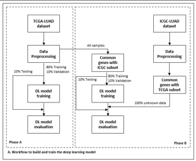

# Deep learning for diagnosis of lung cancer using gene expression

## Data availability
Gene expression data is now available via open-source platforms such as The Cancer Genome Atlas (TCGA) and the Gene Expression Omnibus (GEO).

The available gene expression data are small datasets (i.e., small number of samples) with high dimensional data (i.e., ten of thousands of genes in a dataset) and unbalanced data (usually, the relation between the case and control samples is approximately 1:10).

## Data collection and preprocessing
For training and validating the deep learning model, the RNA-seq expression data of TCGA-LUAD (Lung Adenocarcinomas) dataset  was used. The TCGA-LUAD dataset contains 539 samples with primary tumor, 2 samples with recurrent tumor and 59 normal samples. During data preprocessing, both primary tumor samples (539) and recurrent tumor samples (2) were grouped together and treated as tumor samples (541). For each sample, the TCGA-LUAD dataset lists 19962 genes.

## Workflow
The RNA-seq expression data of TCGA-LUAD dataset downloaded and preprocessed to produce the TCGA-LUAD input dataset that will feed with input data the deep learning model . The input dataset is partitioned into 3 parts (80% - training, 10% validation and 10% testing datasets).

To test the generalization capability of the deep learning model, the ICGC-LUAD  dataset used. It contains 488 lung cancer samples and 55 normal samples. For each sample, the ICGC-LUAD dataset lists the RNA seq counts of 20502 genes. 
The list of common genes between TCGA-LUAD and ICGC-LUAD datasets computed and subsets of both datasets with only the common genes were constructed. The common-genes subset of TCGA-LUAD dataset is used to train and evaluate the DL model.

# Download TCGA-LUAD dataset
**Refer to https://www.youtube.com/watch?v=YJxcsm4aJXI**

**Refer to https://github.com/vappiah/DataMiner**

## Create manifest.txt file

Open from a browser the url: https://portal.gdc.cancer.gov/

Select Repository tab

From Files tab Select the follwing:

    Data Category -> trsnscriptome profiling
    
    Data Type -> Gene Expression Quantification
    
    Experimental Stratgy -> RNA-Seq
    
    Workflow Type -> STAR-Counts
    
From Cases tab select:

    Project -> TCGA-LUAD

Click on AddAllFilesToCart (...600 files will be added) 

Click on Manifest to download the manifest txt file

Rename it to 'manifest.txt' and move it into the project's folder

## Download files

**Open in Spyder the tcga_downloader.py**

*I've some modifications as the TCGA api has recently been modified*

**Run the following commands in the Spyder console:**

`from tcga_downloader import *`

`ids=get_ids('manifest.txt')`

`payload=prepare_payload(ids, data_type='Gene Expression Quantification')`

**Run the following command from a command prompt**

`curl --request POST --header "Content-Type: application/json" --data @Payload https://api.gdc.cancer.gov/files > Metadata.tsv`

**Run the following command from Spyder console**

`download_data('Metadata.tsv',sep='\t', outdir='tcga_data')`

# Data Preprocessing

1. Create a folder called `pruned_tcga_data` and then the following subfolders: `Primary Tumor`, `Recurrent Tumor`, and `Solid Tissue Normal`.

2. Run prune_data.py

3. Run prepare_data.py

4. Run tcga_data_prepare.ipynb

# Model Training

1. Run tcga_training.ipynb

